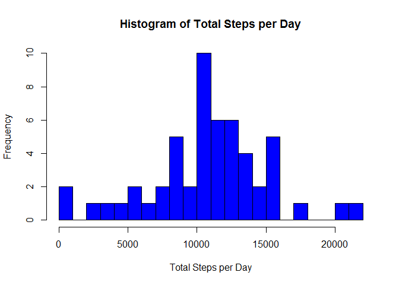
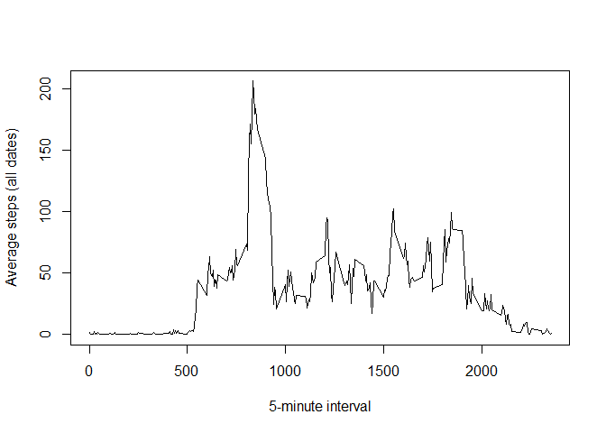
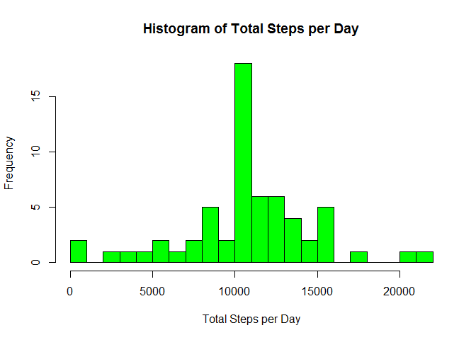
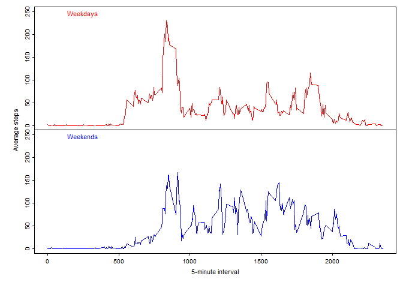

# Reproducible Research: Peer Assessment 1


##1. Loading and preprocessing the data

```r
activityFile <- ".\\activity\\activity.csv"
activitydf <- read.csv(activityFile) 
```
preview contents of file

```r
head(activitydf)
```

```
##   steps       date interval
## 1    NA 2012-10-01        0
## 2    NA 2012-10-01        5
## 3    NA 2012-10-01       10
## 4    NA 2012-10-01       15
## 5    NA 2012-10-01       20
## 6    NA 2012-10-01       25
```

```r
tail(activitydf)
```

```
##       steps       date interval
## 17563    NA 2012-11-30     2330
## 17564    NA 2012-11-30     2335
## 17565    NA 2012-11-30     2340
## 17566    NA 2012-11-30     2345
## 17567    NA 2012-11-30     2350
## 17568    NA 2012-11-30     2355
```

```r
activitydf[activitydf$date=='2012-10-31',]$steps
```

```
##   [1]   0   0   0   0   0   0   0   0   0   0   0   0   0   0   0   0   0
##  [18]   0   0   0   0   0   0   0   0   0   0   0   0   0   0   0   0   0
##  [35]   0   0   0   0   0   0   0   0   0   0   0   0   0   0   0   0   0
##  [52]   0   0   0   0   0   0   0   0   0   0   0   0   0   0   0   0   0
##  [69]   0   0   0   0   0   0   0   0   0   0  22  63  36  65  84 436 594
##  [86] 443 749 717 751 747 757 714 301 584 358   0  32   0   0   0  15  85
## [103] 146   0   0   0  18  18   0  23   0 143 463   0 103   0   0   0 123
## [120] 260 122   0   0   0   0   0 206 128  67   8   0  15  20   0   0   0
## [137]   0   0   0   0   0   0   0   0   0   0   0   0 286 136 170   0   0
## [154]   0   0 157   0   0   7   0   0   0   0   0  65   0   0   0  55   0
## [171]   0   0  82 112  83  17   0   0   0   0   0   0   0   0   0   0   0
## [188]   6  18   0   0   0   0 148 492 191   0   0  59  17  27   0   0   0
## [205]  48  58  89  24 180 414 148 306 111 314  63  68  53  63  12   0  29
## [222] 171  11  77  36  42  64   0  82  48 457 503 140  40  51   0   0   0
## [239]   0   0   0   0   0   0   0   0   0   0   0   0   0   0   0   0   0
## [256]   0   0   0   0   0   0   0   0   0   0   0   0  90  78   0   0   0
## [273]   0   0   0   0   0   0   0   0   0   0   0   0   0   0   0   0
```

```r
activitydf[activitydf$interval==1005,]$steps
```

```
##  [1]  NA   0   0   0   0  26 247  NA   0 105   0   0   0 468   0   0   0
## [18]   0   0   0   0   0   0   0   0   0  31   0   0   0   0  NA 356   0
## [35]  NA   0   0 174   0  NA  NA   0   0   0  NA   0  23   0   0   0   0
## [52]   0   0   0   0   0   0   0   0   0  NA
```

##2.Histogram of the total number of steps taken each day

I will use the base plotting system and increase the number of breaks in the data

```r
activityTotbyDate <- aggregate(steps ~ date, data=activitydf, sum)
hist(activityTotbyDate$steps, col="blue", main="", xlab="", breaks=20) 
title(xlab="Total Steps per Day", main="Histogram of Total Steps per Day")
```

 


##3. What is mean total number of steps taken per day?

I will show both the mean and the median

```r
mean(activityTotbyDate$steps)
```

```
## [1] 10766.19
```

```r
median(activityTotbyDate$steps)
```

```
## [1] 10765
```


## What is the average daily activity pattern?

4.Time series plot of the average number of steps taken

Again, use the base plotting system. This plot will have the NA values omitted

```r
activityMeanbyInterval <- 
      aggregate(steps ~ interval, data=activitydf, mean, na.action = na.omit)
plot(steps ~ interval, data=activityMeanbyInterval, type="l", xlab="", ylab="")
title(xlab="5-minute interval", ylab="Average steps (all dates)")
```

 

5.Display the 5-minute interval that, on average, contains the maximum number of steps

```r
activityMeanbyInterval[which.max(activityMeanbyInterval$steps),]
```

```
##     interval    steps
## 104      835 206.1698
```

## Imputing missing values

The first thing to notice is the the only missing values are for complete days in the dataset and that only steps are missing.


```r
#create dataset for missing values
missingValues <- activitydf[is.na(activitydf),]

#show number of missing values in the dataset
nrow(missingValues)
```

```
## [1] 2304
```

```r
#show dates with missing values
unique(as.Date(missingValues[,"date"]))
```

```
## [1] "2012-10-01" "2012-10-08" "2012-11-01" "2012-11-04" "2012-11-09"
## [6] "2012-11-10" "2012-11-14" "2012-11-30"
```

For missing values in the dataset, I will use the mean per 5-minute interval across all days for each interval in the missing days.


```r
#combine missingvalues dataframe with the Mean value for each 5 minute interval
meanForNA <- merge(missingValues[,c("date", "interval")], activityMeanbyInterval, by="interval")
rm(missingValues) ##clean-up
```

create a new dataset to fill in missing data using mean for the 5 minute interval


```r
#combine activitydf, removing NA's, with the new dataframe using the interval Mean values
activitydfMeanForNA <- rbind(
        activitydf[complete.cases(activitydf),], 
        meanForNA[,c("steps","date","interval")])
rm(meanForNA) ##clean-up
#sort list
activitydfMeanForNA <- activitydfMeanForNA[order(activitydfMeanForNA$date, activitydfMeanForNA$interval),]
```

#7.Histogram of the total number of steps taken each day after missing values are imputed

First Calculate the total number of steps taken per day

```r
activityTotbyDate <- aggregate(steps ~ date, data=activitydfMeanForNA, sum)
```

Show the histogram

```r
hist(activityTotbyDate$steps, col="green", main="", xlab="", breaks=20) 
title(xlab="Total Steps per Day", main="Histogram of Total Steps per Day")
```

 

## Are there differences in activity patterns between weekdays and weekends?

8.Panel plot comparing the average number of steps taken per 5-minute interval 
across weekdays and weekends

First add a column to the dataset with a weekday, weekend factor


```r
#Setup weekend and workday array
weekendDays <- c("Saturday", "Sunday")
workDays <- c("Monday", "Tuesday", "Wednesday", "Thursday", "Friday")

#Create ordered factor for weekday/weekend
dayType <- factor(c("weekday", "weekend"),ordered = TRUE)

#Create aggregate dataframes for weekend and weekdays.  
#Aggregate separately and use rbind to combine. Use cbind 
#to append weekday/weekend factor
activitydfMeanForNA <- rbind(
      cbind(aggregate(steps ~ interval, 
                  data=activitydfMeanForNA[weekdays(as.Date(activitydfMeanForNA$date)) %in% workDays,], 
                  mean), weekday=dayType[1] 
        ),
      cbind(aggregate(steps ~ interval, 
                data=activitydfMeanForNA[weekdays(as.Date(activitydfMeanForNA$date)) %in% weekendDays,], 
                mean), weekday=dayType[2]
        )
    )
```

Create panel plot. I used the base plotting system and tried to customize it, hence the extra code.


```r
par(mfrow = c(2, 1))   #set plots per page
par(mar = c(0,0,0,0))  #set plot margins 
par(oma = c(5,5,1,1))  #set outer margins
par(mgp=c(2,0.6,0))
par(cex=0.6)
par(tcl=-0.25) #set tick length

#plot weekdays
plot(steps ~ interval, 
      data=activitydfMeanForNA[activitydfMeanForNA$weekday=="weekday",], 
      type="l", col="red", ylim=c(0,250), ann=FALSE, xaxt="n")
mtext("Weekdays", col="red", side = 3, line = -1.5, adj = 0.1, cex = 0.7)

#plot weekends
plot(steps ~ interval, 
     data=activitydfMeanForNA[activitydfMeanForNA$weekday=="weekend",], 
     type="l", col="blue", ylim=c(0,250),  ann=FALSE)
mtext("Weekends", col="blue", side = 3, line = -1.5, adj = 0.1, cex = 0.7)

mtext("5-minute interval", side = 1, cex=0.7, outer = TRUE, line = 2.2)
mtext("Average steps", side = 2, cex=0.7, outer = TRUE, line = 2.2)
```

 

There are differences in the pattern between weekends and weekdays as shown above


