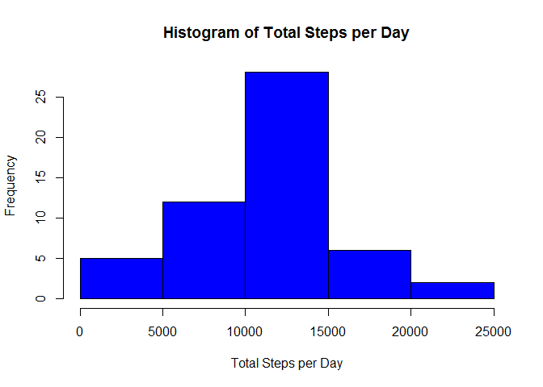
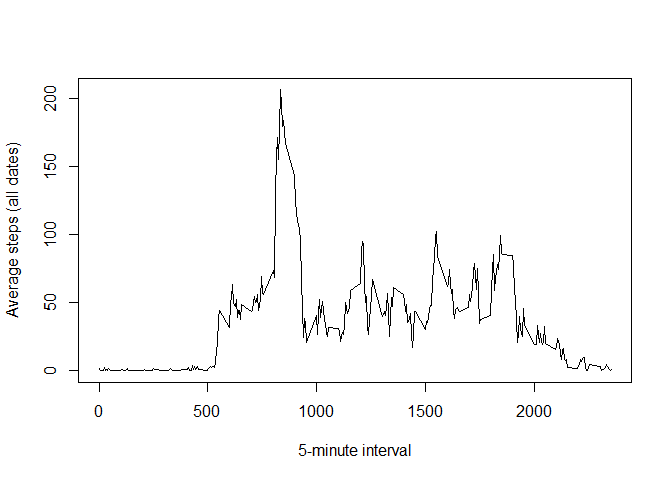
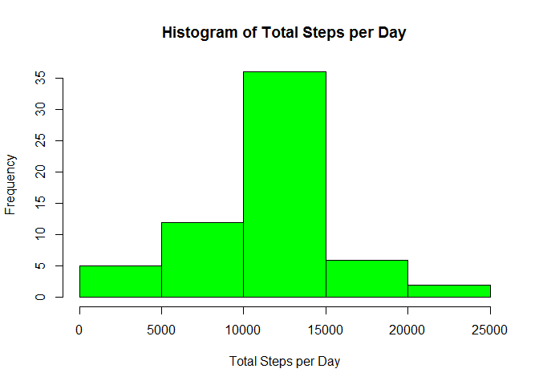

# Reproducible Research: Peer Assessment 1


## Loading and preprocessing the data

```r
activityFile <- ".\\activity\\activity.csv"
activitydf <- read.csv(activityFile) 

#preview contents of file
head(activitydf)
```

```
##   steps       date interval
## 1    NA 2012-10-01        0
## 2    NA 2012-10-01        5
## 3    NA 2012-10-01       10
## 4    NA 2012-10-01       15
## 5    NA 2012-10-01       20
## 6    NA 2012-10-01       25
```

```r
tail(activitydf)
```

```
##       steps       date interval
## 17563    NA 2012-11-30     2330
## 17564    NA 2012-11-30     2335
## 17565    NA 2012-11-30     2340
## 17566    NA 2012-11-30     2345
## 17567    NA 2012-11-30     2350
## 17568    NA 2012-11-30     2355
```

```r
activitydf[activitydf$date=='2012-10-31',]$steps
```

```
##   [1]   0   0   0   0   0   0   0   0   0   0   0   0   0   0   0   0   0
##  [18]   0   0   0   0   0   0   0   0   0   0   0   0   0   0   0   0   0
##  [35]   0   0   0   0   0   0   0   0   0   0   0   0   0   0   0   0   0
##  [52]   0   0   0   0   0   0   0   0   0   0   0   0   0   0   0   0   0
##  [69]   0   0   0   0   0   0   0   0   0   0  22  63  36  65  84 436 594
##  [86] 443 749 717 751 747 757 714 301 584 358   0  32   0   0   0  15  85
## [103] 146   0   0   0  18  18   0  23   0 143 463   0 103   0   0   0 123
## [120] 260 122   0   0   0   0   0 206 128  67   8   0  15  20   0   0   0
## [137]   0   0   0   0   0   0   0   0   0   0   0   0 286 136 170   0   0
## [154]   0   0 157   0   0   7   0   0   0   0   0  65   0   0   0  55   0
## [171]   0   0  82 112  83  17   0   0   0   0   0   0   0   0   0   0   0
## [188]   6  18   0   0   0   0 148 492 191   0   0  59  17  27   0   0   0
## [205]  48  58  89  24 180 414 148 306 111 314  63  68  53  63  12   0  29
## [222] 171  11  77  36  42  64   0  82  48 457 503 140  40  51   0   0   0
## [239]   0   0   0   0   0   0   0   0   0   0   0   0   0   0   0   0   0
## [256]   0   0   0   0   0   0   0   0   0   0   0   0  90  78   0   0   0
## [273]   0   0   0   0   0   0   0   0   0   0   0   0   0   0   0   0
```

```r
activitydf[activitydf$interval==1005,]$steps
```

```
##  [1]  NA   0   0   0   0  26 247  NA   0 105   0   0   0 468   0   0   0
## [18]   0   0   0   0   0   0   0   0   0  31   0   0   0   0  NA 356   0
## [35]  NA   0   0 174   0  NA  NA   0   0   0  NA   0  23   0   0   0   0
## [52]   0   0   0   0   0   0   0   0   0  NA
```

#2.Histogram of the total number of steps taken each day


```r
activityTotbyDate <- aggregate(steps ~ date, data=activitydf, sum)
hist(activityTotbyDate$steps, col="blue", main="", xlab="") 
title(xlab="Total Steps per Day", main="Histogram of Total Steps per Day")
```

 


## What is mean total number of steps taken per day?
##3.Mean and median number of steps taken each day

```r
activityMeanbyDate <- aggregate(steps ~ date, data=activitydf, mean)
activityMeanbyDate
```

```
##          date      steps
## 1  2012-10-02  0.4375000
## 2  2012-10-03 39.4166667
## 3  2012-10-04 42.0694444
## 4  2012-10-05 46.1597222
## 5  2012-10-06 53.5416667
## 6  2012-10-07 38.2465278
## 7  2012-10-09 44.4826389
## 8  2012-10-10 34.3750000
## 9  2012-10-11 35.7777778
## 10 2012-10-12 60.3541667
## 11 2012-10-13 43.1458333
## 12 2012-10-14 52.4236111
## 13 2012-10-15 35.2048611
## 14 2012-10-16 52.3750000
## 15 2012-10-17 46.7083333
## 16 2012-10-18 34.9166667
## 17 2012-10-19 41.0729167
## 18 2012-10-20 36.0937500
## 19 2012-10-21 30.6284722
## 20 2012-10-22 46.7361111
## 21 2012-10-23 30.9652778
## 22 2012-10-24 29.0104167
## 23 2012-10-25  8.6527778
## 24 2012-10-26 23.5347222
## 25 2012-10-27 35.1354167
## 26 2012-10-28 39.7847222
## 27 2012-10-29 17.4236111
## 28 2012-10-30 34.0937500
## 29 2012-10-31 53.5208333
## 30 2012-11-02 36.8055556
## 31 2012-11-03 36.7048611
## 32 2012-11-05 36.2465278
## 33 2012-11-06 28.9375000
## 34 2012-11-07 44.7326389
## 35 2012-11-08 11.1770833
## 36 2012-11-11 43.7777778
## 37 2012-11-12 37.3784722
## 38 2012-11-13 25.4722222
## 39 2012-11-15  0.1423611
## 40 2012-11-16 18.8923611
## 41 2012-11-17 49.7881944
## 42 2012-11-18 52.4652778
## 43 2012-11-19 30.6979167
## 44 2012-11-20 15.5277778
## 45 2012-11-21 44.3993056
## 46 2012-11-22 70.9270833
## 47 2012-11-23 73.5902778
## 48 2012-11-24 50.2708333
## 49 2012-11-25 41.0902778
## 50 2012-11-26 38.7569444
## 51 2012-11-27 47.3819444
## 52 2012-11-28 35.3576389
## 53 2012-11-29 24.4687500
```

```r
activityMedianbyDate <- aggregate(steps ~ date, data=activitydf ,median)
activityMedianbyDate
```

```
##          date steps
## 1  2012-10-02     0
## 2  2012-10-03     0
## 3  2012-10-04     0
## 4  2012-10-05     0
## 5  2012-10-06     0
## 6  2012-10-07     0
## 7  2012-10-09     0
## 8  2012-10-10     0
## 9  2012-10-11     0
## 10 2012-10-12     0
## 11 2012-10-13     0
## 12 2012-10-14     0
## 13 2012-10-15     0
## 14 2012-10-16     0
## 15 2012-10-17     0
## 16 2012-10-18     0
## 17 2012-10-19     0
## 18 2012-10-20     0
## 19 2012-10-21     0
## 20 2012-10-22     0
## 21 2012-10-23     0
## 22 2012-10-24     0
## 23 2012-10-25     0
## 24 2012-10-26     0
## 25 2012-10-27     0
## 26 2012-10-28     0
## 27 2012-10-29     0
## 28 2012-10-30     0
## 29 2012-10-31     0
## 30 2012-11-02     0
## 31 2012-11-03     0
## 32 2012-11-05     0
## 33 2012-11-06     0
## 34 2012-11-07     0
## 35 2012-11-08     0
## 36 2012-11-11     0
## 37 2012-11-12     0
## 38 2012-11-13     0
## 39 2012-11-15     0
## 40 2012-11-16     0
## 41 2012-11-17     0
## 42 2012-11-18     0
## 43 2012-11-19     0
## 44 2012-11-20     0
## 45 2012-11-21     0
## 46 2012-11-22     0
## 47 2012-11-23     0
## 48 2012-11-24     0
## 49 2012-11-25     0
## 50 2012-11-26     0
## 51 2012-11-27     0
## 52 2012-11-28     0
## 53 2012-11-29     0
```


## What is the average daily activity pattern?
##4.Time series plot of the average number of steps taken

```r
activityMeanbyInterval <- aggregate(steps ~ interval, data=activitydf, mean, na.action = na.omit)
plot(steps ~ interval, data=activityMeanbyInterval, type="l", xlab="", ylab="")
title(xlab="5-minute interval", ylab="Average steps (all dates)")
```

 

##5.Display the 5-minute interval that, on average, contains the maximum number of steps

```r
activityMeanbyInterval[which.max(activityMeanbyInterval$steps),"interval"]
```

```
## [1] 835
```

## Imputing missing values

```r
#create dataset for missing values
missingValues <- activitydf[is.na(activitydf),]

#show number of missing values in the dataset
nrow(missingValues)
```

```
## [1] 2304
```

```r
#show dates with missing values
unique(as.Date(missingValues[,"date"]))
```

```
## [1] "2012-10-01" "2012-10-08" "2012-11-01" "2012-11-04" "2012-11-09"
## [6] "2012-11-10" "2012-11-14" "2012-11-30"
```

```r
#update missing values with 5 minute interval mean values

#combine missingvalues dataframe with the Mean value for each 5 minute interval
meanForNA <- merge(missingValues[,c("date", "interval")], activityMeanbyInterval, by="interval")
rm(missingValues) ##clean-up

#create new dataset to fill in missing data using mean for the 5 minute interval

#combine activitydf, removing NA's, with the new dataframe using the interval Mean values
activitydfMeanForNA <- rbind(
        activitydf[complete.cases(activitydf),], 
        meanForNA[,c("steps","date","interval")])
rm(meanForNA) ##clean-up
#sort list
activitydfMeanForNA <- activitydfMeanForNA[order(activitydfMeanForNA$date, activitydfMeanForNA$interval),]


#7.Histogram of the total number of steps taken each day after missing values are imputed

#Calculate the total number of steps taken per day
activityTotbyDate <- aggregate(steps ~ date, data=activitydfMeanForNA, sum)

hist(activityTotbyDate$steps, col="green", main="", xlab="") 
title(xlab="Total Steps per Day", main="Histogram of Total Steps per Day")
```

 

## Are there differences in activity patterns between weekdays and weekends?


```r
#8.Panel plot comparing the average number of steps taken per 5-minute interval 
#   across weekdays and weekends

#Setup weekend and workday array
weekendDays <- c("Saturday", "Sunday")
workDays <- c("Monday", "Tuesday", "Wednesday", "Thursday", "Friday")

#Create ordered factor for weekday/weekend
dayType <- factor(c("weekday", "weekend"),ordered = TRUE)

#Create aggregate dataframes for weekend and weekdays.  
#Aggregate separately and use rbind to combine. Use cbind 
#to append weekday/weekend factor
activitydfMeanForNA <- rbind(
      cbind(aggregate(steps ~ interval, 
                  data=activitydfMeanForNA[weekdays(as.Date(activitydfMeanForNA$date)) %in% workDays,], 
                  mean), weekday=dayType[1] 
        ),
      cbind(aggregate(steps ~ interval, 
                data=activitydfMeanForNA[weekdays(as.Date(activitydfMeanForNA$date)) %in% weekendDays,], 
                mean), weekday=dayType[2]
        )
    )

par(mfrow = c(2, 1))   #set plots per page
par(mar = c(0,0,0,0))  #set plot margins 
par(oma = c(5,5,1,1))  #set outer margins
par(mgp=c(2,0.6,0))
par(cex=0.6)
par(tcl=-0.25) #set tick length

#plot weekdays
plot(steps ~ interval, 
      data=activitydfMeanForNA[activitydfMeanForNA$weekday=="weekday",], 
      type="l", col="red", ylim=c(0,250), ann=FALSE, xaxt="n")
mtext("Weekdays", col="red", side = 3, line = -1.5, adj = 0.1, cex = 0.7)

#plot weekends
plot(steps ~ interval, 
     data=activitydfMeanForNA[activitydfMeanForNA$weekday=="weekend",], 
     type="l", col="blue", ylim=c(0,250),  ann=FALSE)
mtext("Weekends", col="blue", side = 3, line = -1.5, adj = 0.1, cex = 0.7)

mtext("5-minute interval", side = 1, cex=0.7, outer = TRUE, line = 2.2)
mtext("Average steps", side = 2, cex=0.7, outer = TRUE, line = 2.2)
```

 


